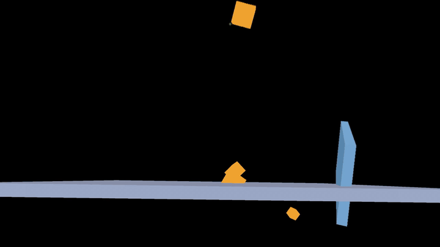

# godot-avp-cascade

**Falling Cascade** — a self-running physics + procedural-audio demo for Apple Vision Pro, built on the Godot game engine via Apple's official upstream visionOS XR contribution (PR [#109975](https://github.com/godotengine/godot/pull/109975)).

Twenty-five emissive cubes — 8-colour fire-plasma palette, randomised sizes — drop onto a tilted catch plate in your immersive space. Each collision triggers a procedurally-synthesized chime (plate chimes have an octave harmonic; cube-on-cube tinks are brighter and shorter). Reach in with your hand and **pinch to grab and throw** any cube. Walk around it.

The first publicly-documented Godot `RigidBody3D` physics scene rendering in immersive mode on real AVP at locked 90 FPS, with working hand-tracking pickup.



## ⚠️ Which Godot engine you need (read this first)

Hand tracking is an **engine capability, not a project setting** — no amount of GDScript or Info.plist tweaking enables it. There are two visionOS Godot engine paths and **they are not interchangeable**:

| Engine | Hand tracking | Use it if… |
|--------|:---:|--------|
| [rsanchezsaez/godot](https://github.com/rsanchezsaez/godot) `apple/visionos-xr` — **Apple's official PR branch** | ❌ render-only | you only want the falling cascade (no grab/throw) |
| [Clancey/godot](https://github.com/Clancey/godot/tree/visionos_master_pr) `visionos_master_pr` — HEAD `2b2f749` | ✅ pinch grab + throw | you want the **full demo as shown above** |

**If the cubes render but you can't grab anything and you never saw a hand-tracking permission prompt — you're on the rsanchezsaez engine. Switch to Clancey's fork.** The missing permission prompt is the tell: rsanchezsaez never asks visionOS for hand data because the hand-tracking code isn't compiled in. See [Troubleshooting](#troubleshooting).

> Apple has stated visionOS hand tracking is "ready but unsubmitted." When it lands in rsanchezsaez/upstream, this repo will migrate to the official path and Clancey's fork won't be needed. Until then, **hand tracking = Clancey's fork.**

## Status

Experimental WIP. Rendering rides on Apple's official visionOS contribution — [rsanchezsaez/godot](https://github.com/rsanchezsaez/godot)'s `apple/visionos-xr` branch (PR open, not yet merged upstream; Ricardo Sanchez-Saez, Apple visionOS team, is lead author — see the [PR thread](https://github.com/godotengine/godot/pull/109975)). **Hand tracking** rides on [Clancey's fork](https://github.com/Clancey/godot/tree/visionos_master_pr), which rebases hand-interaction support on top — see [Which Godot engine you need](#️-which-godot-engine-you-need-read-this-first) above.

Verified working **2026-05-28** on Apple Vision Pro M2 (visionOS 26.5, RealityDevice14,1) using Xcode 26.

- 90 FPS locked, **zero variance across a 95-second sample** (19 × 5-second windows)
- ~475 physics collisions / 95s
- Mobile renderer + Metal driver (Forward+ silently doesn't render on this path)
- Mixed immersion (passthrough) — cubes composite into your real room
- **Pinch-to-grab and throw** any cube with either hand

## What this demo proves

Most public Godot-on-AVP material to date shows either: (a) flat-plane Godot apps in a shared-space window, (b) the rsanchezsaez reference scene (a third-person platformer ported from mobile VR), or (c) the GodotVision/SwiftGodotKit RealityKit-bridged approach.

This is the first published example of:

- `RigidBody3D` simulation running in immersive mode on AVP via the Apple-official native path
- `AudioStreamGenerator` + `push_frame` real-time procedural audio synchronized to physics collisions
- A fully procedural scene (no `.glb`, no `.scn`, no textures) that walks the full XR pipeline
- **Hand-tracking pickup via `XRHandTracker` joint data and `XRController3D`** — pinch distance drives a smooth analog threshold; cubes snap to the pinch midpoint and inherit hand velocity on throw

## How it's built

```
test-project/
  main_v2.tscn        # XR boilerplate scene; gameplay built procedurally in script
  main_v2.gd          # Cascade script — spawn, physics, audio, hand setup
  pickup/
    pickup_handler.gd # PickupHandler3D — pinch detection, fingertip anchoring (Marshall Nowak)
    pickup_able_body.gd # PickupAbleBody3D — grab/snap/throw logic with velocity tracking
  shaders/
    highlight_shader.tres    # Yellow outline on nearest grabbable cube
    highlight_material.tres
  project.godot       # mobile renderer, OpenXR + hand_interaction_profile, alpha-0 clear
  export_presets.cfg  # visionOS preset, app_role=Immersive

out/xcode-visionos/   # generated by Godot --export-pack, packaged by xcodebuild
captures/             # screen recordings + stills from AVP runs
```

`main_v2.tscn` has only `XROrigin3D`, `XRCamera3D`, `WorldEnvironment`, `DirectionalLight3D`, and a script. Everything else — the cubes, the catch plate, the deflector wall, the kill-plane Area3D, the audio player, the physics material, the two `XRController3D` + `PickupHandler3D` hand nodes — is created in code in `_ready()`. Saves editor round-trips during iteration.

## Quickstart (build + deploy)

You need:
- macOS Apple Silicon (M1+) with Xcode 26 installed
- Apple Vision Pro paired and trusted to your Xcode
- Your Apple Developer Team ID
- A built `libgodot.a` + matching `Godot.app` editor from **[Clancey/godot](https://github.com/Clancey/godot/tree/visionos_master_pr) `visionos_master_pr` (HEAD `2b2f749`)** for hand tracking — or rsanchezsaez `apple/visionos-xr` if you only want the render-only cascade. See [building-the-engine](#building-the-engine) below. **Build both from the same commit** so the editor that exports the PCK matches the runtime lib.

```bash
# Re-export the PCK from the test-project
~/godot-visionos-pilot/Godot.app/Contents/MacOS/Godot --headless \
  --path test-project \
  --export-pack "visionOS" \
  out/xcode-visionos/GodotVisionPilot.pck

# Build and sign the visionOS app
xcodebuild \
  -project out/xcode-visionos/GodotVisionPilot.xcodeproj \
  -scheme GodotVisionPilot \
  -configuration Debug \
  -destination "platform=visionOS,id=<YOUR_DEVICE_UDID>" \
  CODE_SIGN_IDENTITY="Apple Development" \
  DEVELOPMENT_TEAM="<YOUR_TEAM_ID>" \
  build

# Install
xcrun devicectl device install app \
  --device <YOUR_DEVICE_UDID> \
  $(ls -d ~/Library/Developer/Xcode/DerivedData/GodotVisionPilot-*/Build/Products/Debug-xros/GodotVisionPilot.app)
```

**You then put on the headset and tap the app icon.** Remote-launch via `devicectl device process launch` does not work for immersive apps (Apple's CoreDevice returns `connection invalidated` for immersive-space launches).

## Things to Try

1. **Confirm the scene renders at 90 FPS.** Pull diagnostic frame counts after a run: `xcrun devicectl device copy from --device <UDID> --source Documents/xr_diag.txt --destination /tmp/xr_diag.txt --domain-type appDataContainer --domain-identifier com.agilelens.godotvisionpilot`. Per-5s frame deltas should be exactly 450.
2. **Grab and throw a cube.** Bring your index finger and thumb together (pinch) near any glowing cube — it will highlight yellow and snap to your pinch point. Flick your wrist and release to throw. Try deflecting a cascade of falling cubes.
3. **Reposition the rig.** The catch plates and deflector wall are grabbable too — pinch one and move it, and it stays where you release it (it won't fall). Redirect the whole cascade mid-stream.
4. **Change the spawn rate.** Edit `SPAWN_INTERVAL` in `test-project/main_v2.gd`. Try `0.15` for a downpour, `0.8` for a trickle. Re-export the PCK (`--export-pack`) and re-deploy.
5. **Switch to full immersion.** Change `UISceneInitialImmersionStyle` from `UIImmersionStyleMixed` to `UIImmersionStyleFull` in `out/xcode-visionos/GodotVisionPilot/GodotVisionPilot-Info.plist`, then rebuild. The Digital Crown already works to blend in progressive immersion if you change the style key to `UIImmersionStyleProgressive`.
6. **Add a second cascade tier.** Drop another tilted plate beneath the first at `y=−0.5` rotated `+15°` on X so it catches cubes that fall off the first plate. Coin-pusher feel.

## Building the engine

For **hand tracking**, build from [Clancey/godot](https://github.com/Clancey/godot/tree/visionos_master_pr) branch `visionos_master_pr` (HEAD `2b2f749`, 2026-03-03 — "Full hand tracking with pinch-based interaction"). For **render-only**, build from rsanchezsaez `apple/visionos-xr`. Either way you produce a `Godot.app` editor and a `libgodot.a` (xros-arm64) static lib. Building takes 30–90 minutes on an M1 Max.

> The binary this repo was verified against was built from a *pre-rebase* commit of the same branch (`85f0afd`, now diverged from the tip). Both have hand tracking; `2b2f749` is the current branch HEAD and the right target for a fresh build.

**Build the editor and the lib from the same commit.** The editor exports the PCK; the lib runs it. If their Godot versions differ (e.g. exporting with a 4.6.3 editor against a 4.6.2 lib), tokenized GDScript can fail to load at runtime — the app renders nothing but passthrough, with no crash. Two ways to avoid it:
1. Use a matched editor+lib pair (preferred), **or**
2. Set `script_export_mode=0` (Text) in `export_presets.cfg` so the runtime compiles scripts from source and the token format no longer has to match. This repo currently uses Text mode because its editor (4.6.3) and lib (Clancey 4.6.2) differ.

Recipe + gotchas documented in detail at:
- [agile-lens-kb/intelligence/techniques/godot-visionos-xr.md](https://github.com/AgileLens/agile-lens-kb/blob/master/intelligence/techniques/godot-visionos-xr.md) — full engine-build gotchas, scene-recipe details, `XROrigin3D.current=true` requirement
- [agile-lens-kb/intelligence/techniques/godot-avp-hand-tracking-engine-swap.md](https://github.com/AgileLens/agile-lens-kb/blob/master/intelligence/techniques/godot-avp-hand-tracking-engine-swap.md) — engine-fork requirement, the version-gap fix, swap recipe
- [agile-lens-kb/intelligence/techniques/godot-avp-falling-cascade.md](https://github.com/AgileLens/agile-lens-kb/blob/master/intelligence/techniques/godot-avp-falling-cascade.md) — this demo's gotchas, perf numbers, code patterns

The engine source tree is `.gitignore`'d here (regenerable from the fork above).

## Troubleshooting

| Symptom | Cause | Fix |
|---------|-------|-----|
| **Cubes fall and render, but I can't grab anything, and I never got a hand-tracking permission prompt** | You're on the **rsanchezsaez** engine (render-only) — it never requests hand data | Rebuild/link against **Clancey's fork** (HEAD `2b2f749`). See [Which Godot engine you need](#️-which-godot-engine-you-need-read-this-first) |
| **App opens but I only see passthrough — no cubes at all** | The main scene's GDScript failed to load (compile error, or a tokenized-script version mismatch between editor and lib) | Run the project headless first: `Godot --headless --path test-project --quit-after 120` and fix any `SCRIPT ERROR`. If editor/lib versions differ, set `script_export_mode=0` (Text). |
| **`--export-pack` "succeeded" but the app runs old code / nothing changed** | Output path was relative — it resolves from the **project dir**, not your shell's cwd | Use an **absolute** path for the PCK output |
| **`devicectl install` fails: "unable to locate device"** | AVP is asleep (it sleeps when not worn) | Put the headset on, retry 2–3× |
| **Cubes render but no permission prompt AND grab still dead after switching engines** | Missing Info.plist privacy strings | Ensure `NSHandsTrackingUsageDescription` + `NSWorldSensingUsageDescription` are in the built bundle (`plutil -extract … <app>/Info.plist`) |

## Known limitations

- **Mobile renderer only.** Forward+ doesn't render on this path. No Lumen/Nanite-equivalent quality.
- **Hand mesh not rendered.** Visual hand skeleton (`XRHandModifier3D`) is excluded from this build to keep the scene minimal. Only the pickup sphere and fingertip anchor are active.
- **Manual app launch on the headset.** `xcrun devicectl device process launch` returns `connection invalidated` for immersive-space apps. The user has to tap the icon.
- **MSAA does not work on this branch yet.** Blocked on Godot PR [#78598](https://github.com/godotengine/godot/pull/78598). Don't enable it.
- **Hand-as-collision-mesh not yet implemented.** The hand can grab and throw but does not act as a physics collider for passive deflection. The plan is five `AnimatableBody3D` capsules driven by `XRHandTracker` joint positions.

## Credits

- Engine: [Godot](https://godotengine.org/) — open source
- visionOS XR port: [Ricardo Sanchez-Saez @ Apple](https://github.com/rsanchezsaez) + community contributors (huisedenanhai, stuartcarnie, BastiaanOlij)
- **Hand tracking pickup system:** [Marshall Nowak (Nocxr)](https://github.com/Nocxr) @ Agile Lens — `PickupHandler3D` / `PickupAbleBody3D` from [visionosxr_hand_tracking](https://github.com/Clancey/godot/tree/visionos_master_pr), ported from [Clancey's hand-tracking fork](https://github.com/Clancey/godot/tree/visionos_master_pr)
- Demo + writeup: [Agile Lens](https://agilelens.com/)

## License

MIT. See [LICENSE](LICENSE).
