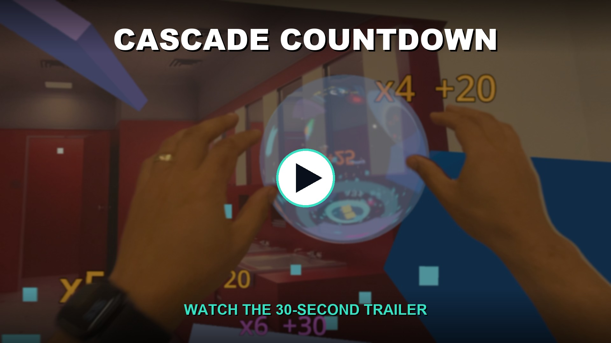
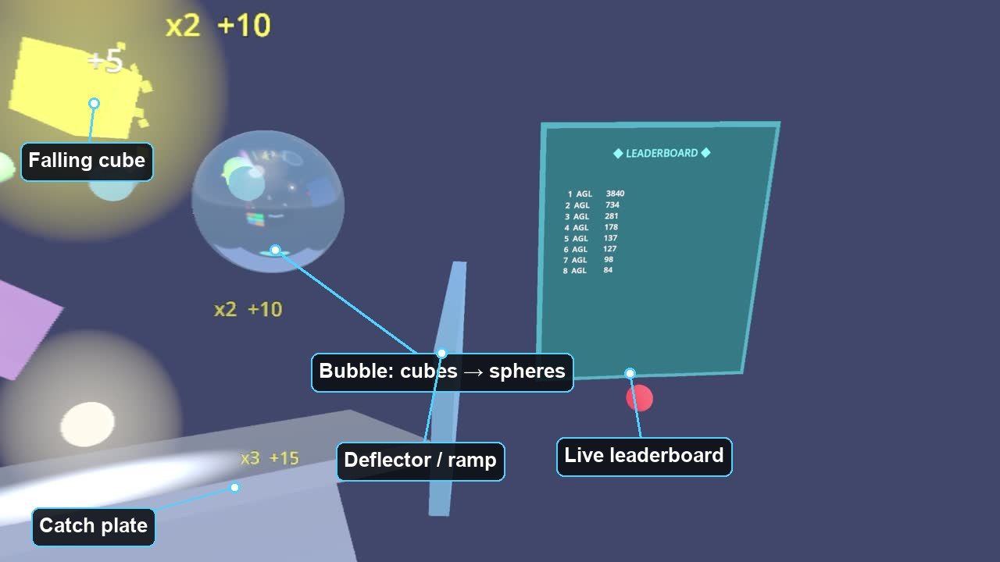
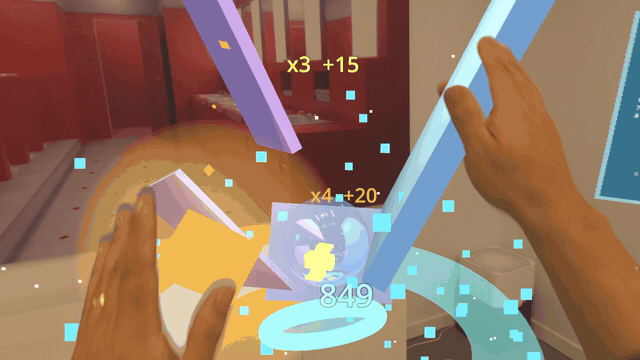
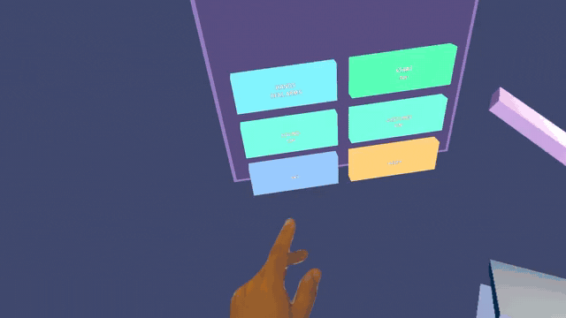
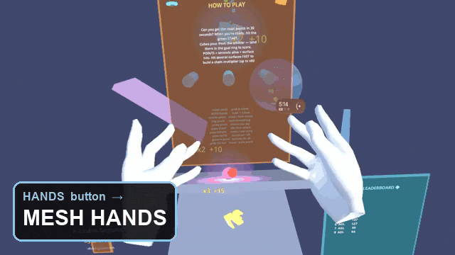

# Cascade Countdown

**Cascade Countdown** — a hand-tracked physics arcade game for Apple Vision Pro, built on the Godot game engine via Apple's official upstream visionOS XR contribution (PR [#109975](https://github.com/godotengine/godot/pull/109975)).

> ⚠️ **Not affiliated with the Godot Foundation.** Cascade Countdown is an independent app by Alex Coulombe. It is built *with* the open-source Godot engine but is **not** created, published, endorsed, or sponsored by the Godot Foundation. "Godot" is a trademark of the Godot Foundation.

Emissive cubes — 8-colour fire-plasma palette, randomised sizes — cascade down through spinning bumpers and a prism splitter onto tilted catch plates in your immersive space. Reach in and **pinch to grab and throw** any cube into the goal ring; keep them alive and bouncing to rack up points, then poke **START** for a 30-second countdown time-attack with a procedural soundtrack. Every collision is a synthesized chime pitch-snapped to the key, so the chaos harmonises into a tune. Walk around it.

The first publicly-documented Godot `RigidBody3D` physics scene rendering in immersive mode on real AVP at locked 90 FPS, with working hand-tracking pickup.


## ▶️ Watch the 30-second trailer

[](captures/CascadeCountdown_trailer.mp4)

*Click to play (30s, with sound — the game's procedural soundtrack). Pinch to grab &amp; move, real ↔ virtual hands, the immersion dissolve, two-hand scaling, and the high-score celebration. Scan the on-screen QR at the end to install free from TestFlight.*

> 📖 **New to Godot or visionOS — or just want to see how this was built?** The **[project wiki](https://github.com/ibrews/godot-avp-cascade/wiki)** is a beginner-friendly (ELI5) walkthrough: Godot basics, the hand-tracking pickup, the live-synthesized audio, and the silent-failure gotchas. (This README is the full technical spec.)

## ▶️ Try it on Apple Vision Pro (TestFlight)

**[Join the public beta → testflight.apple.com/join/bw1aeExJ](https://testflight.apple.com/join/bw1aeExJ)**

No build required — install Apple's [TestFlight](https://apps.apple.com/app/testflight/id899247664) app on your Vision Pro, open the link above, and tap **Install**. Then launch **Cascade Countdown** from your Home View and put the headset on. (The rest of this README is for developers who want to build from source.)

## ⚠️ Which Godot engine you need (read this first)

Hand tracking is an **engine capability, not a project setting** — no amount of GDScript or Info.plist tweaking enables it. There are two visionOS Godot engine paths and **they are not interchangeable**:

| Engine | Hand tracking | Use it if… |
|--------|:---:|--------|
| [rsanchezsaez/godot](https://github.com/rsanchezsaez/godot) `apple/visionos-xr` — **Apple's official PR branch** | ❌ render-only | you only want the falling cascade (no grab/throw) |
| [Clancey/godot](https://github.com/Clancey/godot/tree/visionos_master_pr) `visionos_master_pr` — HEAD `2b2f749` | ✅ pinch grab + throw | you want the **full game as shown above** |

**If the cubes render but you can't grab anything and you never saw a hand-tracking permission prompt — you're on the rsanchezsaez engine. Switch to Clancey's fork.** The missing permission prompt is the tell: rsanchezsaez never asks visionOS for hand data because the hand-tracking code isn't compiled in. See [Troubleshooting](#troubleshooting).

> Apple has stated visionOS hand tracking is "ready but unsubmitted." When it lands in rsanchezsaez/upstream, this repo will migrate to the official path and Clancey's fork won't be needed. Until then, **hand tracking = Clancey's fork.**

## Status

Experimental WIP. Rendering rides on Apple's official visionOS contribution — [rsanchezsaez/godot](https://github.com/rsanchezsaez/godot)'s `apple/visionos-xr` branch (PR open, not yet merged upstream; Ricardo Sanchez-Saez, Apple visionOS team, is lead author — see the [PR thread](https://github.com/godotengine/godot/pull/109975)). **Hand tracking** rides on [Clancey's fork](https://github.com/Clancey/godot/tree/visionos_master_pr), which rebases hand-interaction support on top — see [Which Godot engine you need](#️-which-godot-engine-you-need-read-this-first) above.

Verified working **2026-06-01** on Apple Vision Pro M2 (visionOS 26.5, RealityDevice14,1) using Xcode 26; hand-grab refined through **2026-06-02**. **Live on [TestFlight](https://testflight.apple.com/join/bw1aeExJ)** (build 7, panel `v0.9.34`).

- 90 FPS locked, **zero variance across a 95-second sample** (19 × 5-second windows)
- ~475 physics collisions / 95s
- Mobile renderer + Metal driver (Forward+ silently doesn't render on this path)
- Mixed immersion (passthrough) — cubes composite into your real room
- **Pinch-to-grab and throw** any cube with either hand — grab-by-point, anchored to the de-spiked thumb tip
- **Two-hand pinch to scale + rotate** any object, or the whole world via the floating chrome handle
- One grabbable **control panel** (HANDS / START / MUTE / GESTURES / SKY / RESET) + a 30 s time-attack with a procedural soundtrack and a global leaderboard
- System wrist/Home menu hidden for uninterrupted immersion via the `GodotPersistentSystemOverlays` Info.plist key (build 7)

## What Cascade Countdown proves

Most public Godot-on-AVP material to date shows either: (a) flat-plane Godot apps in a shared-space window, (b) the rsanchezsaez reference scene (a third-person platformer ported from mobile VR), or (c) the GodotVision/SwiftGodotKit RealityKit-bridged approach.

Cascade Countdown is the first published example of:

- `RigidBody3D` simulation running in immersive mode on AVP via the Apple-official native path
- `AudioStreamGenerator` + `push_frame` real-time procedural audio synchronized to physics collisions
- A fully procedural scene (no `.glb`, no `.scn`, no textures) that walks the full XR pipeline
- **Hand-tracking pickup via `XRHandTracker` joint data and `XRController3D`** — thumb–index pinch distance drives a smooth analog threshold; you grab an object *by the exact point you pinched* (it rotates about that point, anchored to the de-spiked thumb tip and eased by a one-euro filter), and it inherits your hand velocity on throw

## How it's built

```
test-project/
  main_v2.tscn        # XR boilerplate scene; gameplay built procedurally in script (run/main_scene)
  main.tscn           # historical 14-box minimal scene; kept as a render-only fallback
  main_v2.gd          # Cascade Countdown script (~2.8k lines, banner-sectioned) — spawn, physics, audio, hand setup, scoring
  hand_mesh_driver.gd # HandMeshDriver3D — poses the GLTF hand mesh from XRHandTracker joints (bone-frame correction)
  pickup/
    pickup_handler.gd # PickupHandler3D — pinch detection, fingertip anchoring (Marshall Nowak)
    pickup_able_body.gd # PickupAbleBody3D — grab/snap/throw logic with velocity tracking
  sandbox/            # the procedural gameplay actors, one small class each:
    spawn_emitter.gd      #   SpawnEmitter3D — grabbable cube faucet
    goal_portal.gd        #   GoalPortal3D — grabbable scoring ring (cubes pass through, score + despawn)
    bubble_transmuter.gd  #   BubbleTransmuter3D — grabbable bubble; cubes passing through become spheres
    scene_handle.gd       #   SceneHandle3D — chrome handlebar to grab + scale/rotate the whole world
    score_popup.gd        #   ScorePopup3D — floating "x3 +15" multiplier text
    big_score_popup.gd    #   BigScorePopup3D — volumetric end-of-round cash-out number
  shaders/
    highlight_shader.tres    # inverted-hull outline: cyan = nearest grabbable, green = held, blue = two-hand scale
    highlight_material.tres
  passthrough_depth_fix.gdshader # full-screen depth/alpha fix for clean mixed-immersion edges (see below)
  openxr_action_map.tres # OpenXR actions ("pickup") + hand_interaction_profile
  project.godot       # mobile renderer, OpenXR + hand_interaction_profile, alpha-0 clear
  export_presets.cfg  # visionOS preset, app_role=Immersive

out/xcode-visionos/   # generated by Godot --export-pack, packaged by xcodebuild
captures/             # screen recordings + stills from AVP runs
```

`main_v2.tscn` has only `XROrigin3D`, `XRCamera3D`, `WorldEnvironment`, `DirectionalLight3D`, and a script. Everything else — the cubes, the catch plate, the deflector wall, the kill-plane Area3D, the grabbable spawn emitter / goal portal / cube→sphere bubble transmuter, the audio player, the physics material, the two `XRController3D` + `PickupHandler3D` hand nodes — is created in code in `_ready()`. Saves editor round-trips during iteration.



## Quickstart (build + deploy)

You need:
- macOS Apple Silicon (M1+) with Xcode 26 installed
- Apple Vision Pro paired and trusted to your Xcode
- Your Apple Developer Team ID
- A built `libgodot.a` + matching `Godot.app` editor from **[Clancey/godot](https://github.com/Clancey/godot/tree/visionos_master_pr) `visionos_master_pr` (HEAD `2b2f749`)** for hand tracking — or rsanchezsaez `apple/visionos-xr` if you only want the render-only cascade. See [building-the-engine](#building-the-engine) below. **Build both from the same commit** so the editor that exports the PCK matches the runtime lib.

> 💡 **Prototype in the visionOS Simulator** — far faster to iterate than a device round-trip, and it shows the real spatial render. The **[godot-visionos-simulator-kit](https://github.com/ibrews/godot-visionos-simulator-kit)** gives you a one-command `./build.sh sim | device` switcher plus simulator input + hand-tracking tooling (extracted from this project so any Godot visionOS app can use it). The manual steps below are what it wraps.

```bash
# Re-export the PCK from the test-project
~/godot-visionos-pilot/Godot.app/Contents/MacOS/Godot --headless \
  --path test-project \
  --export-pack "visionOS" \
  out/xcode-visionos/GodotVisionPilot.pck

# Build and sign the visionOS app
xcodebuild \
  -project out/xcode-visionos/GodotVisionPilot.xcodeproj \
  -scheme GodotVisionPilot \
  -configuration Debug \
  -destination "platform=visionOS,id=<YOUR_DEVICE_UDID>" \
  CODE_SIGN_IDENTITY="Apple Development" \
  DEVELOPMENT_TEAM="<YOUR_TEAM_ID>" \
  build

# Install
xcrun devicectl device install app \
  --device <YOUR_DEVICE_UDID> \
  $(ls -d ~/Library/Developer/Xcode/DerivedData/GodotVisionPilot-*/Build/Products/Debug-xros/GodotVisionPilot.app)
```

**You then put on the headset and tap the app icon.** Remote-launch via `devicectl device process launch` does not work for immersive apps (Apple's CoreDevice returns `connection invalidated` for immersive-space launches).

## Things to Try

1. **Confirm the scene renders at 90 FPS.** Pull diagnostic frame counts after a run: `xcrun devicectl device copy from --device <UDID> --source Documents/xr_diag.txt --destination /tmp/xr_diag.txt --domain-type appDataContainer --domain-identifier com.agilelens.godotvisionpilot`. Per-5s frame deltas should be exactly 450.
2. **Grab and throw a cube — by any point.** Pinch (index + thumb) near any glowing cube — it sticks to *exactly where you grabbed it* and rotates about that point (grab a flat panel by its edge and the edge stays under your finger, instead of the panel's centre snapping to your hand). Flick your wrist and release to throw it into the goal ring.
3. **Use the one control panel.** A single grabbable panel holds **all six buttons** in a 2×3 grid — **HANDS** (3-way cycle: mesh → both → real Persona arms — you always see *some* hands, never empty space), **START** (30s round), **MUTE**, **GESTURES** (master on/off for the middle/ring/pinky pinches — index-pinch grab always works), **SKY** (immersion), **RESET** — with a big **★ BEST ★** readout up top. Grab the panel and move it wherever you like; the buttons keep working in their new spot.
4. **Play the 30-second time attack — with a soundtrack.** Poke **START**. A looping bass-and-drum bed plays one beat per second so you can hear the clock; the final few seconds speed up and rise in pitch. Every cube impact is pitch-snapped to the same key, so the chaos harmonises into a tune over the bed. Land cubes in the goal ring and chain fast surface hits for a multiplier (up to x8); your score posts to the global leaderboard.
5. **Keep cubes *alive* — longevity pays off big.** Score rewards how long a cube survives on an **accelerating** curve, so a cube you keep bouncing around the course is worth far more than one that drops straight through. A spinning bar bumper and a prism splitter scatter the falling stream to help (and a literal funnel straight to the goal is now the *worst* strategy, not the best).
6. **Resize the goal for a difficulty multiplier.** Two-hand-pinch the goal ring to shrink or grow it. A **smaller goal is harder → bigger points multiplier** (up to ×4); a bigger goal is easier → fewer points (down to ×0.25). The live multiplier shows under the ring and on each cash-out popup.
7. **Beat your high score for fireworks + a cheer.** End a round above your personal best and the whole room fills with a cascade of fireworks bursts and a procedural crowd cheer. Beat the **top score on the online leaderboard** and you get an even bigger, distinct celebration — electric cyan/magenta bursts and a fuller cheer with a sparkle tail.

   
8. **Scale and rotate the whole world.** Pinch the floating chrome handle bar with **both** hands and move them apart / rotate — the world scales and spins around you (the ring turns blue). Pinch any object with both hands to scale just that object (its outline turns blue).
9. **Switch immersion and listen.** Poke **SKY** (or pinky-pinch) to dissolve the sky between full immersion and passthrough mixed reality — now with a textured tonal swell of well-spaced, varied in-key ticks across the whole transition (pitch rises in, falls out). Mixed reality composites cleanly over passthrough with no halos (see the depth-bias fix below).

   
10. **Transmute a cube into a sphere.** Send a falling cube through the floating **bubble** and it comes out the other side as a glowing sphere. Landing one of *each* — a cube and a sphere — back-to-back in the goal pays a **mix bonus**, so the bubble is a scoring tool, not just eye candy (and you can grab and reposition it).

## Building the engine

For **hand tracking**, build from [Clancey/godot](https://github.com/Clancey/godot/tree/visionos_master_pr) branch `visionos_master_pr` (HEAD `2b2f749`, 2026-03-03 — "Full hand tracking with pinch-based interaction"). For **render-only**, build from rsanchezsaez `apple/visionos-xr`. Either way you produce a `Godot.app` editor and a `libgodot.a` (xros-arm64) static lib. Building takes 30–90 minutes on an M1 Max.

> The binary this repo was verified against was built from a *pre-rebase* commit of the same branch (`85f0afd`, now diverged from the tip). Both have hand tracking; `2b2f749` is the current branch HEAD and the right target for a fresh build.

**Build the editor and the lib from the same commit.** The editor exports the PCK; the lib runs it. If their Godot versions differ (e.g. exporting with a 4.6.3 editor against a 4.6.2 lib), tokenized GDScript can fail to load at runtime — the app renders nothing but passthrough, with no crash. Two ways to avoid it:
1. Use a matched editor+lib pair (preferred), **or**
2. Set `script_export_mode=0` (Text) in `export_presets.cfg` so the runtime compiles scripts from source and the token format no longer has to match. This repo currently uses Text mode because its editor (4.6.3) and lib (Clancey 4.6.2) differ.

The key engine-build gotchas (the `XROrigin3D.current=true` requirement, the mobile-renderer constraint, and the editor/lib version-match rule) are all captured in this README — see [Troubleshooting](#troubleshooting) and [Known limitations](#known-limitations). The engine source tree is `.gitignore`'d here (regenerable from the fork above).

## Real Persona arms (the `upper_limb.txt` toggle)

The **HANDS** button cycles `MESH → BOTH → REAL`. The first two (the virtual GLTF hand mesh) work out of the box. The **REAL** mode — compositing your actual Persona arms over the scene — is controlled by SwiftUI's `.upperLimbVisibility(...)` on the `ImmersiveSpace`, which is **baked at build time** from the `GodotUpperLimbVisibility` key in `Info.plist`. To flip it **live at runtime**, you need a small engine-side change. Without that change the app still runs fine — it just always shows the mesh hands, and the REAL/BOTH modes won't reveal your real arms.



There are two paths:

**Option A — static (no recompile).** Set the visibility once in `out/xcode-visionos/GodotVisionPilot/GodotVisionPilot-Info.plist`:
```xml
<key>GodotUpperLimbVisibility</key>
<string>visible</string>   <!-- or "hidden" / "automatic" -->
```
This bakes the choice into the build; it can't be changed without rebuilding the app.

**Option B — live runtime toggle (engine recompile).** The app writes the user's choice to `user://upper_limb.txt` (which maps to `Documents/upper_limb.txt` on visionOS), and the engine polls that file ~2×/sec and re-applies `.upperLimbVisibility` live. The GDScript side already ships in this repo:
```gdscript
# main_v2.gd — _write_arms_pref()
var f := FileAccess.open("user://upper_limb.txt", FileAccess.WRITE)
if f != null:
    f.store_string("visible" if _real_arms_visible else "hidden")  # or "automatic"
    f.close()
```
The engine side is a change to **`platform/visionos/app_visionos.swift`** (in your Godot fork checkout): an `ObservableObject` model whose `@Published var visibility` is refreshed by a `@MainActor` poll loop that reads `Documents/upper_limb.txt`, with the `ImmersiveSpace` ending in `.upperLimbVisibility(limbModel.visibility)`. Rebuild `libgodot.a` afterward.

Three gotchas, each of which costs a compile if you miss it:
1. **`app_visionos.swift` is compiled *into* `libgodot.a`** (via `platform/visionos/SCsub`'s `Glob("*.swift")`), so this is an **engine recompile**, not an app-target edit. The generated Xcode project only carries `dummy.swift`.
2. **Use classic `ObservableObject` + `@Published` + `@StateObject`, not `@Observable`.** The fork's Swift build is a hand-rolled `swift-frontend` invocation with no macro-plugin paths, so the `@Observable` macro fails to expand. `import Combine`.
3. **The immersive content is `CompositorContent`, not a `View`** — `.task` / `.onChange` / `.onReceive` aren't available on the `CompositorLayer { … }` closure, so the poll must live in the model's own `Task { @MainActor … }`, not a view `.task`. The build is `-swift-version 6 -warnings-as-errors`, so it must be strict-concurrency-clean.

The complete resolver — `upperLimbVisibilityFromFile()` (file → Info.plist → controller default → `.automatic`) and the `@MainActor` 500 ms poll on `UpperLimbVisibilityModel` — lives in `platform/visionos/app_visionos.swift` in the Clancey fork. Diff it there against the stock file to apply the patch.

## Troubleshooting

| Symptom | Cause | Fix |
|---------|-------|-----|
| **Cubes fall and render, but I can't grab anything, and I never got a hand-tracking permission prompt** | You're on the **rsanchezsaez** engine (render-only) — it never requests hand data | Rebuild/link against **Clancey's fork** (HEAD `2b2f749`). See [Which Godot engine you need](#️-which-godot-engine-you-need-read-this-first) |
| **App opens but I only see passthrough — no cubes at all** | The main scene's GDScript failed to load (compile error, or a tokenized-script version mismatch between editor and lib) | Run the project headless first: `Godot --headless --path test-project --quit-after 120` and fix any `SCRIPT ERROR`. If editor/lib versions differ, set `script_export_mode=0` (Text). |
| **`--export-pack` "succeeded" but the app runs old code / nothing changed** | Output path was relative — it resolves from the **project dir**, not your shell's cwd | Use an **absolute** path for the PCK output |
| **`devicectl install` fails: "unable to locate device"** | AVP is asleep (it sleeps when not worn) | Put the headset on, retry 2–3× |
| **Cubes render but no permission prompt AND grab still dead after switching engines** | Missing Info.plist privacy strings | Ensure `NSHandsTrackingUsageDescription` + `NSWorldSensingUsageDescription` are in the built bundle (`plutil -extract … <app>/Info.plist`) |

## Known limitations

- **Mobile renderer only.** Forward+ doesn't render on this path. No Lumen/Nanite-equivalent quality.
- **Near plane set to 0.1 m (AVP minimum).** Objects render right up to ~10 cm from your face. Increase `XRCamera3D.near` in `main_v2.tscn` if you see z-fighting at close range.
- **Manual app launch on the headset.** `xcrun devicectl device process launch` returns `connection invalidated` for immersive-space apps. The user has to tap the icon.
- **MSAA does not work on this branch yet.** Blocked on Godot PR [#78598](https://github.com/godotengine/godot/pull/78598). Don't enable it. (It's *not* needed for clean passthrough edges — see the depth-bias fix below.)
- **Hand-as-collision-mesh not yet implemented.** The hand can grab and throw but does not act as a physics collider for passive deflection.
- **Live "REAL arms" toggle needs an engine patch.** The HANDS button's REAL/BOTH modes only reveal your real Persona arms if the engine polls `upper_limb.txt` — see [Real Persona arms](#real-persona-arms-the-upper_limbtxt-toggle). On a stock build, set visibility statically via the `GodotUpperLimbVisibility` Info.plist key instead.

## Mixed-reality passthrough: the blocky-alpha-halo fix

In mixed immersion, visionOS CompositorServices requires **alpha == 0 wherever depth == 0**, or content shows blocky grey/dark halos at its edges over passthrough. Godot's mobile XR path uses reverse-Z (depth 0 = nothing drawn), so transparent / additive / no-depth-write geometry leaves nonzero alpha at depth 0 and trips the artifact. The fix (`test-project/passthrough_depth_fix.gdshader`) is a full-screen quad, child of `XRCamera3D`, that writes a tiny depth (`1e-8`) + alpha 0 everywhere via `depth_draw_always` so depth is never exactly 0 — pure shader, no engine recompile. Confirmed in [Godot PR #109975](https://github.com/godotengine/godot/pull/109975#issuecomment-3446873204) (huisedenanhai's shader, verified by maintainer dsnopek).

## Credits

- Engine: [Godot](https://godotengine.org/) — open source
- visionOS XR port: [Ricardo Sanchez-Saez @ Apple](https://github.com/rsanchezsaez) + community contributors (huisedenanhai, stuartcarnie, BastiaanOlij)
- **Hand tracking pickup system:** [Marshall Nowak (Nocxr)](https://github.com/Nocxr) — `PickupHandler3D` / `PickupAbleBody3D` from [visionosxr_hand_tracking](https://github.com/Clancey/godot/tree/visionos_master_pr), ported from [Clancey's hand-tracking fork](https://github.com/Clancey/godot/tree/visionos_master_pr)
- Cascade Countdown game + writeup: [Alex Coulombe (@ibrews)](https://github.com/ibrews)

## License

MIT. See [LICENSE](LICENSE).
